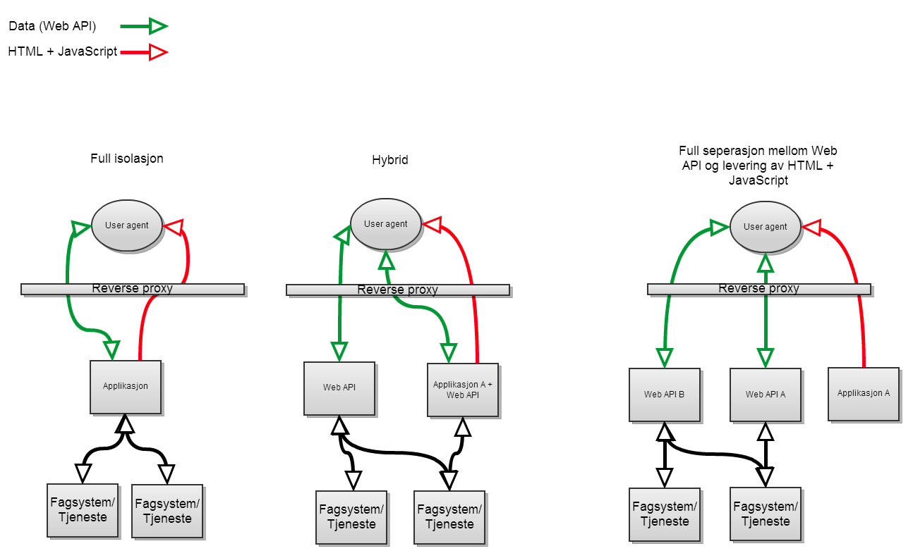

:title: Webarkitektur - Pathstruktur

----

Webarktitektur part 1
=====================

----

Mål (Øyvind)
============

    * Forståelse for utfordringen med mangel på konvensjoner på pather

    * På sikt etablere en tydelig konvensjon som fremmer gjenbruk og lave vedlikeholdskonstnader.

    * Informasjon og tilbakemelding før vi fremmer til arkitekturråd

----

:id: seperation

Endringer i arkitektur (Øyvind)
================================

----

Status i dag (Ken)
==================

    * Noen tradisjonelle JSF-applikasjoner, som er isolerte

    * Noen JavaScript-applikasjoner som bruker flere tjenester

    * Skattefinn som første 360view applikasjon?

    * Ingen konvensjoner

----

Utviklervennlighet  (Ken)
==================================

    * Indireksjonslag på alle tjenester

    * Mange applikasjoner kommer langt med å bruke eksisterende tjenester

----

Forslag
=======

::

    /api - I praksis JSON over HTTP. Ressursorientert, ikke applikasjonsorientert
    /web - Tradisjonelle webapper med en backend
    /app - Tynne JavaScript-applikasjoner som kan deployes som rene filer

----

Eksempler
=========

::

    /api/part/identifisering/identifiser?TIN=23913820913 <- Returner data om personen
    /web/jsfapplikasjon <- En hvilken som helst applikasjon med backend
    /app/skattefinn <- Tynn javascriptapplikasjon. Kun statiske filer

-----

Driftbarhet (Øyvind)
====================

    * Forutsigbarhet for BigIP og WebSEAL-driftere

    * Enhetlig deploymentmodell for alle miljøer
        * Alt ligger bak en reverse proxy, alltid

----

Vedlikehold (Øyvind)
====================

    * Prosjekter varer ikke evig

        * Komponenter blir tatt over av linjen. Fordel å gjøre ting likt.

    * Det er krysskoblinger i dag, så dette er ikke noe nytt.

    * Fokus på API har mange fordeler

        * Tydelig hva som kan gjenbrukes

        * Lettere å teste maskinelt

        * Lettere å plassere ansvar

----

Sikkerhet (Øyvind)
==================

    * Nå-situasjon:
        * Utviklingsmiljø som er fjernt fra produksjonsmiljø
        * CORS
        * Avslått sikkerhet i utvikling
        * Kan ikke force HTTP sikkerhetsheadere som Content-Security-Policy og Strict-Transport-Security
        * Vanskeligere å deploye web application firewall

----

    * Ønsker:
        * Et utviklingsmiljø som er likt prod for å fjerne utviklingstilpasninger
        * Mulighet til å sette sikkerhetsheadere globalt
        * Begrense HTTP?
        * Kontrollere data som går fra ytre til sikkert nivå (WAF)

----

Hva kreves? (Øyvind)
====================

    * Tjenesteoversikt (som alltid)
    * Noen må være koordinator (Webarktitekt)

----

Eksempel (Ken)
==============

* Vise flere miljø?
* Vise to applikasjoner i samme miljø
* Skattefinn
* Partsøk

----

Diskusjon
=========

